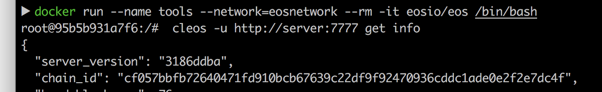
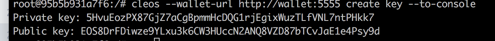
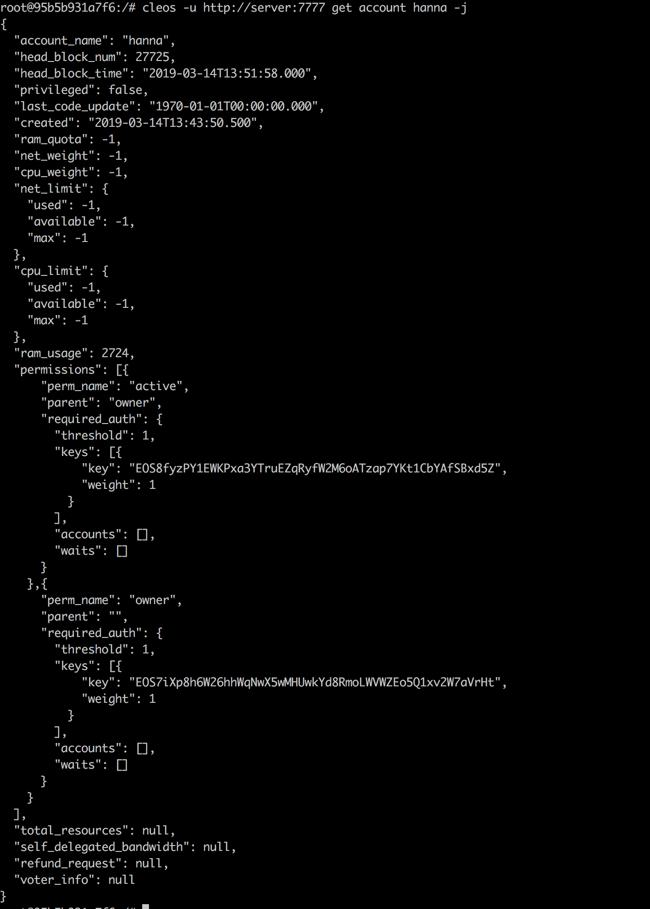
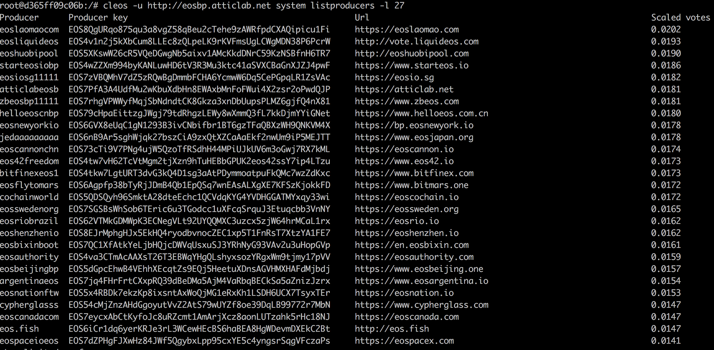
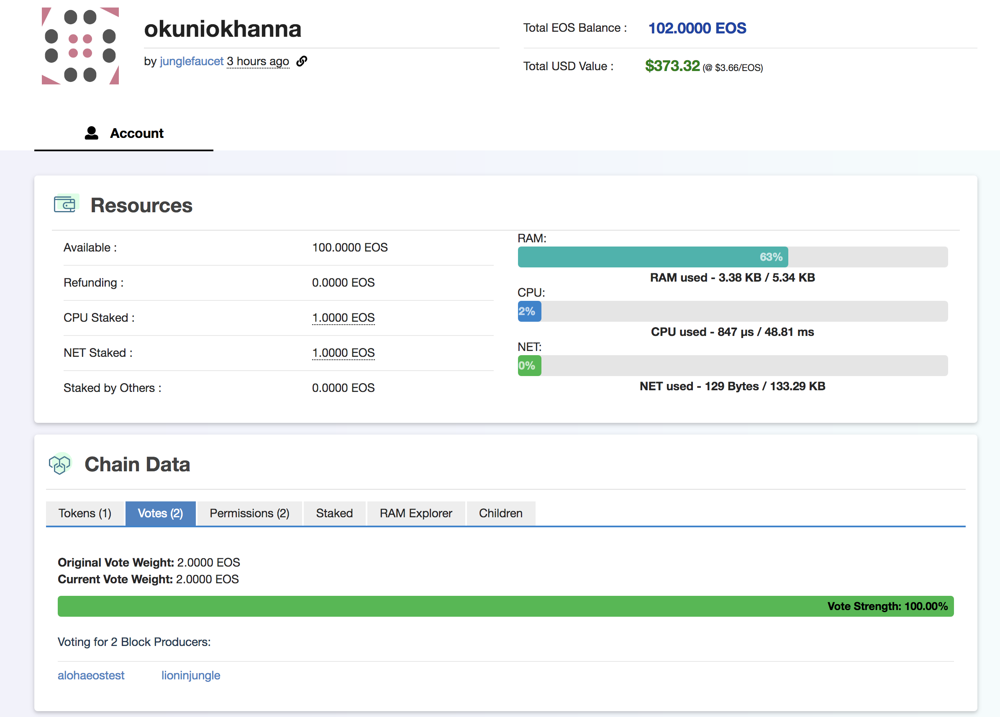
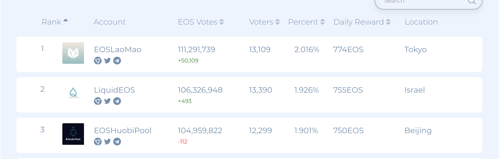

# EOS Onboarding

Tasks list:
*** 
1. Get chain_id EOS 
***

Use command: 
```
cleos -u http://server:7777 get info
 ```   
You will get:


***
2. Generate a pair of keys (public private) (eosjs)
***
```
cleos --wallet-url http://wallet:5555 wallet create --to-console
```
You will get a password like this:

PW5JXijq6ZMHtfX5ad6z4AqsgSNmDyqCRpKwDU1ZK611Tj14irZxL

For creating new keys you need to use:
```    
cleos --wallet-url http://wallet:5555 create key --to-console
```
You will get info like in screenshot above:


***
3. Get all Block Producers (BPs) in the networ If you have a full node use 
***
command line:
```sh
cleos system listproducers
```
Or you can use other server/api
```
cleos -u http://eosbp.atticlab.net system listproducers
```
Or you can use websites such as:
http://eos-bp-votes.dapptools.info/s/api/block-producer-votes-stack-html/1/70
https://eosnetworkmonitor.io
https://eosnodes.privex.io

It is not secure method, because you need to trust thats providers, but full node occupy a lot of space.
***
4. Install scatter and cleos, create accounts in testnet (find a purse that supports testnet, find a way to create accounts in testnet, get yourself test EOS 
***
For creating an account use command:
```sh
$cleos --wallet-url http://wallet:5555 -u http://server:7777 create account eosio mynewaccount {MyNewAccount owner Public Key} {MyNewAccount active Public Key}
```
in my case is:
```sh
cleos --wallet-url http://wallet:5555 -u http://server:7777 create account eosio hanna EOS7iXp8h6W26hhWqNwX5wMHUwkYd8RmoLWVWZEo5Q1xv2W7aVrHt EOS8fyzPY1EWKPxa3YTruEZqRyfW2M6oATzap7YKt1CbYAfSBxd5Z
```

I had an error:

``` 
Error 3090003: Provided keys, permissions, and delays do not satisfy declared authorizations
Ensure that you have the related private keys inside your wallet and your wallet is unlocked.
```
for fixing it I had import a private key from eosis account. It occured because an account can create only other account and 'eosis' is a default account. But you may have not for default its private key:

```
5KQwrPbwdL6PhXujxW37FSSQZ1JiwsST4cqQzDeyXtP79zkvFD3
```

import command is:

```
cleos --wallet-url http://wallet:5555 wallet import
```

If you want to check your account type a command:

```
cleos -u http://server:7777 get account {account_name} -j
```

And you would get:



***
5. Find the top 21 (eos system table) 
***

Use command:

```sh
cleos -u http://eosbp.atticlab.net system listproducers -l 27
```

You will get:



***
6. Vote for a pair of BP. 
***

For voting can be used https://monitor.jungletestnet.io/

Firstly create an account: my login is okuniokhanna

Than download __Scatter__
In Scatter:
* Add an jungle testnet to the network
* Import active key which was used in jungle and name it
* Create an indntities in jungle network

In website you can vote with your scatter identity

Or using a command:

```sh
cleos system voteproducer prods {accaunt_name} {BP1} -p {accaunt_name}
```

For finding my vote follow this link:
https://jungle.bloks.io/account/okuniokhanna




***
7. Calculate how much EOS gets per day top 3 BP  
***
Here: https://eosauthority.com/producers_rank you can find a rank, so we need to sub 3 first params from Daily Reward:



As for now Daily reward is: 774 EOS + 755 EOS + 750 EOS = 2279 EOS

***
8. Find the formula for calculating the vote decay for the account  
***

```c++
   double stake2vote( int64_t staked ) {
      double weight = int64_t( (now() - (block_timestamp::block_timestamp_epoch / 1000)) / (seconds_per_day * 7) )  / double( 52 );
      return double(staked) * std::pow( 2, weight );
   }
```

***
9. Create another permission for your own one 
***

```sh
cleos set account permission bob bob1 EOS8FtkJYmJZWx37e6bLmqgi6urptxHNjLdyqG63ife1ToDYyN31f -p bob@owner
```

***
10. create Block Producer
***

```sh
cleos system regproducer bob EOS6MRyAjQq8ud7hVNYcfnVPJqcVpscN5So8BhtHuGYqET5GDW5CV http://producer.site 25
```

***
11. API to find the action (get_action) in which the transaction with the voice that you made in the task above 
***

***
12. Find the top 10 largest proxies, find the weight of the voice in the top 10 proxies and the weight of the voice in all accounts that vote through a prox 
***

Follow this link: https://www.alohaeos.com/vote/proxy?sort=rank&sortDir=asc

    

  

  


   
